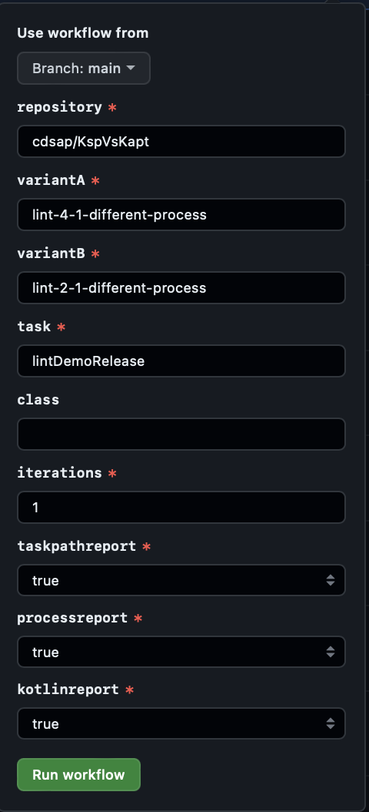
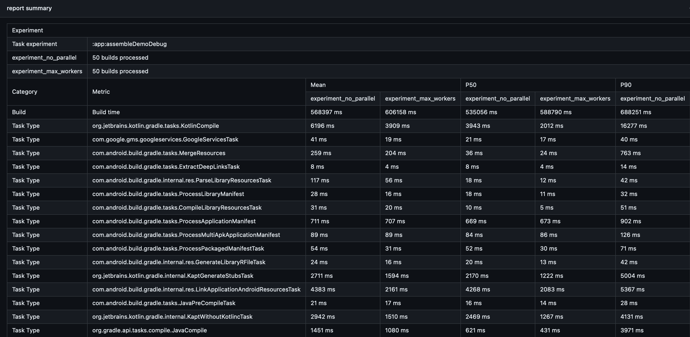
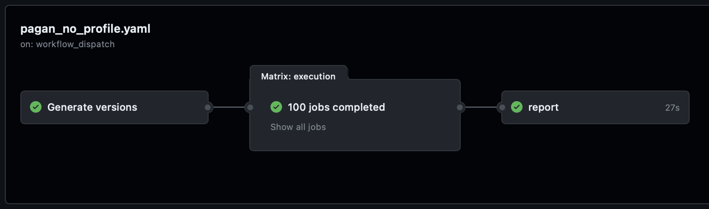
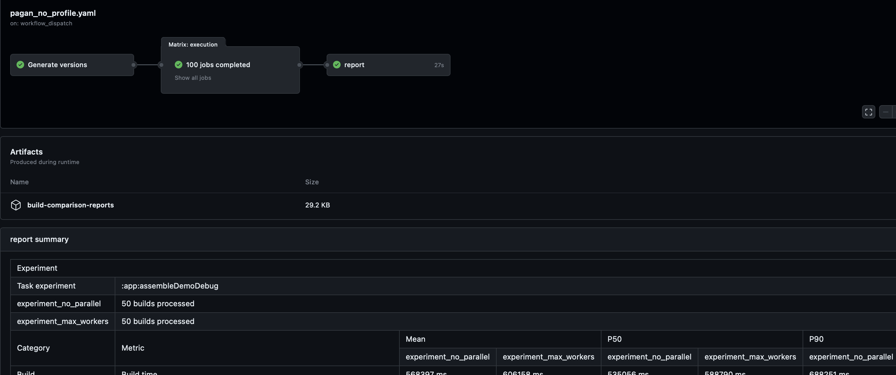
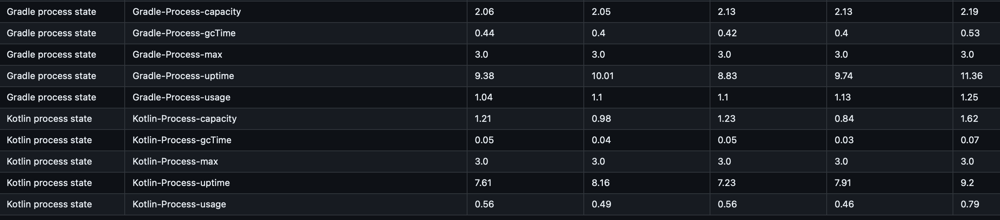
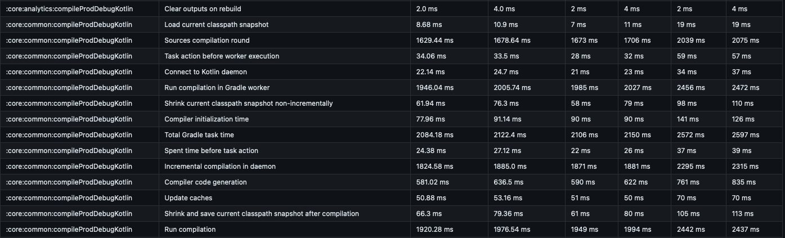

## Pagan
Sample showing how to build a functional Experimentation Framework on GitHub Actions for Gradle-Based Builds connected to Develocity.

## How works
The repository contains `workflow_dispatch` actions that orchestrate the execution, data extraction and publication of the
results of the experiments.


The experiment is composed by two variants represented by the branch name. Given a requested task, Pagan will
execute for each variant the type of experiment with N iterations. When all the builds are finsihed it
will extract the results of the experiment and will report a summary:



## Types of experiment
Pagan supports two type of experiments:
* Experiments running with Gradle Profiler
* Experiments without Gradle Profiler

### Experiments with Gradle Profiler
`pagan.yaml`

Each variant is executed with the action `.github/workflows/runner-gradle-profiler`.
We can include a list of classes where we want to apply `abi-changes` scenario in the Gradle Profiler execution.
We create two different runs, represeing each variant, executing N times the requested build. The default warmpups of this
experiment is 2.

### Experiments without Gradle Profiler
`pagan_no_profile.yaml`

Each variant is executed with the action  `.github/workflows/runner`. Based on the number of iterations, it will create N
runners for each variant. The build executed will the requested task included in the experiment. For instance, for a experiment
with 50 iterations, it will create 100 jobs:


## Extracting and Publishing results
Once both variants have executed all the jobs, Pagan will execute `.github/workflows/runner`.
This action, uses the CLI [CompareGEBuilds](https://github.com/cdsap/CompareGEBuilds) that retrieves and aggregates the data
for both variants:
```
./buildsComparison --experiment-id 154 --variants lint-4-1 --variants lint-2-1 \
    --requested-task lintDemoRelease --api-key $GE_API \
    --url $GE_URL
```

The CLI generates a text report with the results of the experiment added as summary report of the action:


Additionally, an artifact with name `build-comparison-reports` is published with the results of the experiment in csv format:
```
type,metric,mean_experiment_no_parallel,mean_experiment_max_workers,mean_unit,p50_experiment_no_parallel,p50_experiment_max_workers,p50_unit,p90_experiment_no_parallel,p50_experiment_max_workers,p90_unit
Build,Build time,568397,606158,ms,535056,588790,ms,688251,707314,ms
Task Type,org.jetbrains.kotlin.gradle.tasks.KotlinCompile,6196,3909,ms,3943,2012,ms,16277,5391,ms
Task Type,com.google.gms.googleservices.GoogleServicesTask,41,19,ms,21,17,ms,40,30,ms
Task Type,com.android.build.gradle.tasks.MergeResources,259,204,ms,36,24,ms,763,506,ms
Task Type,com.android.build.gradle.tasks.ExtractDeepLinksTask,8,4,ms,8,4,ms,14,8,ms
Task Type,com.android.build.gradle.internal.res.ParseLibraryResourcesTask,117,56,ms,18,12,ms,42,24,ms
Task Type,com.android.build.gradle.tasks.ProcessLibraryManifest,28,16,ms,18,11,ms,32,20,ms
...
```
## Metrics
Pagan provides a report of the variants under experimentation based on the Develocity API information of the builds:
* Build duration
* Duration grouped by Task Type
* Duration by Task Path

### Gradle and Kotlin process metrics
Adding experiment metrics for each variant of the Kotlin and Gradle process.
* Gradle Process metrics
    * Requires https://github.com/cdsap/InfoGradleProcess
* Gradle Process metrics
  * Requires https://github.com/cdsap/InfoKotlinProcess



### Kotlin Build reports
Provides detailed metrics of the Kotlin compiler for each variant
* Kotlin Build Report group by metric
  * Requires https://blog.jetbrains.com/kotlin/2022/06/introducing-kotlin-build-reports/
* Kotlin Build Report group by task path
  * Requires https://blog.jetbrains.com/kotlin/2022/06/introducing-kotlin-build-reports/




## Why the name Pagan?
The name of the repository is not related to religion, Pagan is the old Burmese transcription for Bagan.
And Bagan also the name of old project I used to experiment with Gradle builds:
https://github.com/cdsap/Bagan
